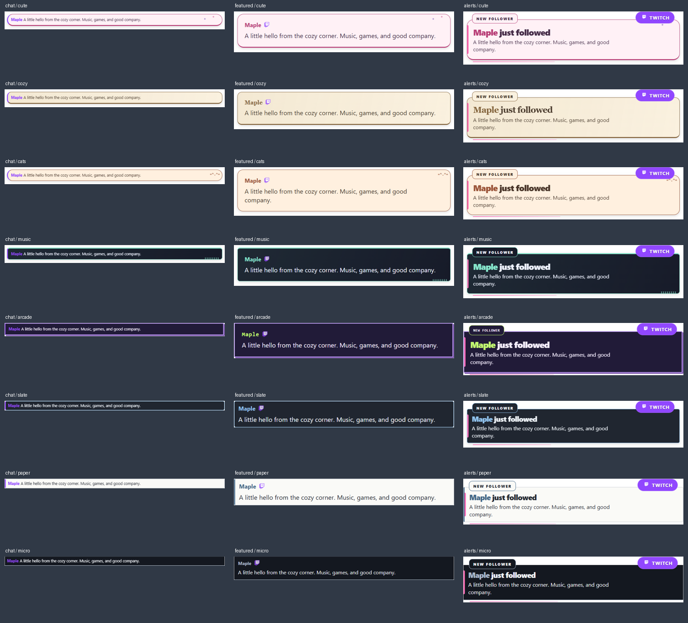

# Matching overlay collections

Choose these presets in **Pre-styled chat overlays**, **Featured chat overlay**, or any category preset under **Multi-alerts**. Each collection uses packaged CSS with no GIF service, font download, or image download required for its decoration.



| Collection | Style value | Appearance |
| --- | --- | --- |
| Pastel Pop | `cute` | Blush cards, rounded edges, candy dots |
| Cozy Cafe | `cozy` | Warm cream, coffee accents, serif featured names |
| Cat Cafe | `cats` | Peach cards and a small cat motif |
| Studio Sessions | `music` | Dark studio panels with an equalizer detail |
| Pocket Arcade | `arcade` | Violet pixel borders and lime accents |
| Compact Slate | `slate` | Small, quiet dark cards |
| Compact Paper | `paper` | Crisp light cards with restrained borders |
| Micro Line | `micro` | Slim dark strips with minimal padding |

## Direct links

Replace `YOUR_SESSION_ID` and select a style from the table:

```text
https://socialstream.ninja/themes/compact-clean.html?session=YOUR_SESSION_ID&style=cats
https://socialstream.ninja/themes/featured-styles/featured-modern.html?session=YOUR_SESSION_ID&style=cats
https://socialstream.ninja/multi-alerts.html?session=YOUR_SESSION_ID&followstyle=cats&substyle=cats&donostyle=cats&bitsstyle=cats&raidstyle=cats&auctionstyle=cats&hypestyle=cats
```

Chat links generated by the popup inherit the main chat auto-hide setting. Direct links accept `showtime` in milliseconds (`0` disables timed hiding). Featured messages use their own `showtime`; alert duration and queue settings remain under Multi-alerts. Each surface keeps its existing transport, session/password, content-image and filtering behavior. Select a different collection for each alert category if desired.

These styles respond to source width and respect reduced motion. Existing `reverse`, avatar, badge and font controls remain available for chat. Multi-alert color, radius and flat-card overrides still apply.

## GIF search migration

Google retired the Tenor API on June 30, 2026. Configure a **GIPHY API key** in the GIF settings; a saved Tenor key cannot authenticate to GIPHY.

- `!giphy search words`: search GIFs when its toggle is enabled.
- `!tenor search words`: compatibility alias, using GIPHY and the existing alias toggle.
- `#happy_cat`: GIF search when hashtag search is enabled.
- `##happy_cat`: transparent sticker search.
- A following number chooses a zero-based result offset, for example `#happy_cat 2`.

Trigger text is removed only after a successful lookup when the hide-trigger option is enabled. Missing keys, empty results, rate limits, and network failures preserve the original chat. Existing direct media URLs and saved Event Flow media actions are unchanged; Tenor's API retirement does not mean every Tenor-hosted URL is unavailable.

References: [Tenor retirement notice](https://support.google.com/tenor/answer/10455265?hl=en), [GIPHY migration guide](https://developers.giphy.com/docs/api/tenor-migration/). Design direction informed by the cozy, cat, retro and minimalist collections in the [Streamlabs library](https://streamlabs.com/library/); artwork and CSS here are original.
